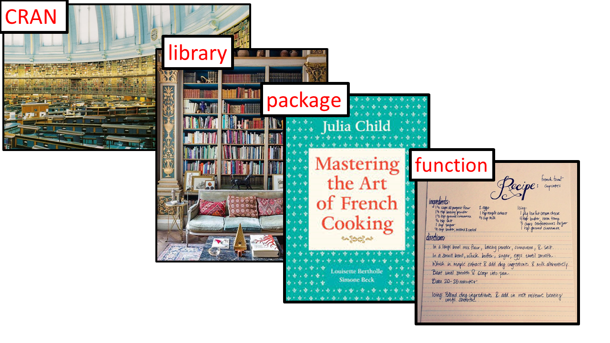
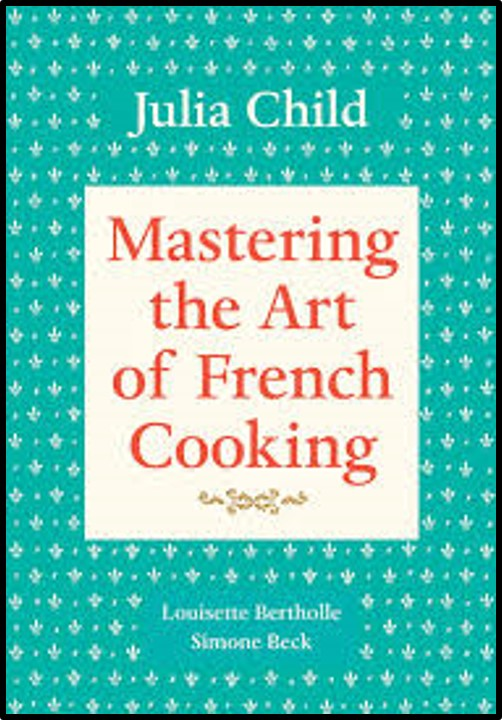
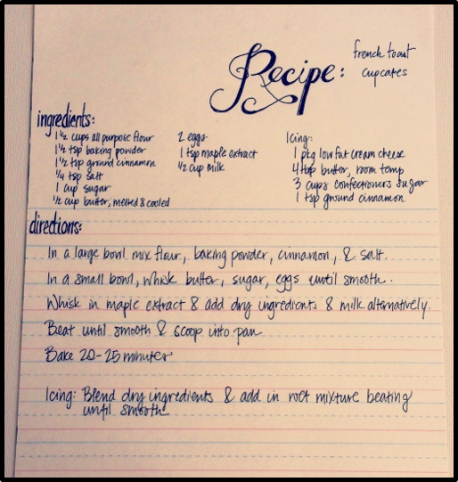
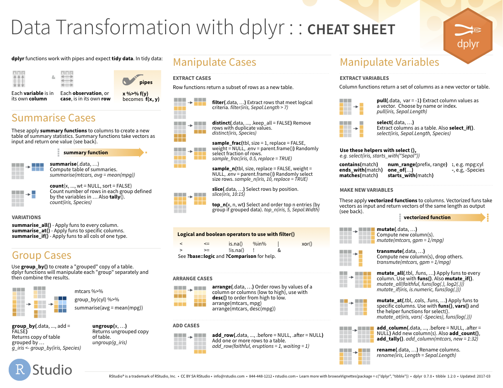

## Objectives:

- Familiarise yourself with RStudio and R Notebooks, which is what we’ll use to interact with R.

- Learn about the simple data structures in R: object, vector, and data frame.

- Explore R's basic data types = integer, character, numeric 

- Learn where to go for help. 


-Extra time

- Learn to read data into R. 

- Create simple visualisations using `ggplot2`.


# Welcome to R!


R is a versatile coding language for data science, with a wonderful community supporting it. Here's a short list of some of the things that make R great.

1. **Free and open source** It's a free and open source programming language and environment for statistical computing, data science, and data visualization 

2. **Reproducibility and Reporting** writing reproducible reports is now easier than ever thanks to packages like knitr and R Markdown. R, beyond being a computer language, is a flexible system that allows the entire data analysis process, from data collection to reporting, to be carried out without leaving the same environment provided by RStudio. This makes analysis less error-prone and facilitates external scrutiny. 

3. **RStudio** RStudio is a powerful Interactive Development Environment that has made learning R and using R much easier. With options for workflow and project management.  

4. **Data Visualization** R can be used to make great data graphics, with packages like ggplot2 helping users make graphics in an intuitive way. 

5. **R Packages and Community** With over 18,000 packages on [CRAN](https://cran.r-project.org/) alone, there’s pretty much a package to do anything. The greater R community has also expanded tremendously over time, bringing in new users and pushing R to be useful in more applications. Each year there are thousands of meetups, conferences, seminars, and workshops on R all around the world.
Check out R User conference (https://user2022.r-project.org)


# RStudio and RNotebooks

R and RStudio often cause confusion, however they serve different purposes. We can compare it to a car and its parts. R is like a car's engine while RStudio is like a car's dashboard. 


## RStudio


RStudio is an interactive development environment (IDE) for R and is structured into various panels/ sections for easy of use. 
The borders of these can be dragged to expand or contract individual panes, and can be arranged as you prefer by clicking Tools > Global Options > Pane Layout in the menu.
Some can also be detached from the main window to be made fullscreen.


 ](pictures/RStudio_quadrants.jpg){width=650px}

- **Q1**: script, data, command to run script
  - This is the panel you’re reading this tutorial in. It contains the script editor where we can create and edit R Notebook files, among other files.
- **Q2**: console (the “smart” part)
  - This is the Console Panel where R code is passed to and executed.
- **Q3**: environment/ workspace
  - The environment tab keeps track of variables we’ve created in this workspace.
- **Q4**: files, plots, packages, help
  - This is a multi-purpose panel which contains:
      - **Files:** A basic file explorer,
      - **Plots:** Where plots can be rendered,
      - **Packages:** install and import libraries into R,
      - **Help:** Explorer for Documentation of functions and libraries,
      - **Viewer:** View local web content e.g. Shiny app.

There are many other features. See https://www.rstudio.com/products/rstudio/.


### Settings

First let's set it so that our notebook shows up in our viewer. 

* Click on the gear icon next to Knit on the menu. Select Preview in Viewer Pane. 

{width=650px}

* Now click on the little arrow next to Knit and select "Knit to HTML".rst

Some people like RStudio to remember stuff from session to session. However, this can be dangerous as previous work and packages can interfere with current code and make your code more breakable. To avoid this, it is recommended that you change two settings in RStudio.


Locate Preferences (On Windows, this is in the Tools->Global Options menu; on a Mac, this is in the RStudio menu). In the General tab, uncheck “Restore .RData…” and select “never” for “Save workspace…”

 ](pictures/RStudio_settings.jpg){width=650px}


## R Notebooks

R Notebooks give the opportunity to combine code and description in a single human-readable notebook. You can conduct analysis and give interpretation side-by-side! 
We will focus on using R Studio to produce R Notebooks, a particular type of R Markdown document.

### Features of R markdown notebooks

An R markdown notebook has the following characteristics
    
  * Reproducible workflow by default.
    
  * Code, output and narrative in a single document.
    
  * Output to multiple formats (html, PDF, Word).
    
  * Output inline with code: When you execute code within the notebook, the results appear beneath the code.
    
  * It is possible to share output and code in a single file.


### R Markdown notebook file formats

  * The notebook source code is a .Rmd file

  * Notebooks have an associated HTML file (.nb.html). It is created automatically when the .Rmd is saved. When you save a notebook, an HTML file containing the code and output will be saved alongside it (click the Preview button or press Cmd+Shift+K to preview the HTML file).
    
  * The preview shows you a rendered HTML copy of the contents of the editor. Consequently, unlike Knit, Preview does not run any R code chunks. Instead, the output of the chunk when it was last run in the editor is displayed.

  * When a .nb.html file is opened in RStudio it will automatically open a .Rmd file with the source code.

### Where the code goes...

We will be entering the R code into blocks of codes and they are called “chunks”. The chunks can be executed independently and interactively, with output visible immediately beneath the input. 
Notebook chunks are inserted using the keyboard shortcut Ctrl + Alt + I (macOS: Cmd + Option + I), or via the Insert menu in the editor toolbar. Also, a chunk can be inserted manually by typing  ````{r} ` ,then type the code in the next line. lastly, close the chunk by typing ```` ` in a separate line.

{width=650px}

```{r Print a statement}
#add comment 
print('code goes here!')

```
Note,You can write comments inside a chunk. * You can comment or uncomment code using `Ctrl + Shift + C`. Comments are always preceded by #. our comments can be notes for yourself, or explanation of what the code is doing for someone to follow.
We can run the code chunk use the play button on the right.


See https://bookdown.org/yihui/rmarkdown/notebook.html


# CRAN, library, packages, and functions

So far, we have explored R and how they work together with RStudio. However, it is much much more than that! One of the things that makes R amazing is the open source community surrounding it.

The R community which is made up of academics,software engineers, statisticians, social and political scientists, economists, and data scientists to name a few, are responsible for authoring a wide variety of packages (>18,000) that can do a wide range of data manipulation, visualisation, and analysis tasks. 


To get your head around what CRAN, library, packages, and functions are I find it helpful to think of books. 

## CRAN

CRAN stands for the **C**omprehensive **R** **A**rchive **N**etwork. It's like the R equivalent of the National Library or National Museum Library. It holds a copy of every package (book) and all the versions of R. 

{width=650px}

## Library

On your computer you'll have a local library with copies of the packages you've installed from CRAN (your home office book shelf).

### What's on your bookshelf?

* Click on the 'Packages' tab in the lower right hand panel (Q4 from before). You can see what packages are in your library, a short description of what they do, and the package version. 
* The packages that are loaded have a check mark in the box on the left. As before, there are several packages that are automatically loaded each time you start an R session, e.g. `base` package.  

* Although it is possible to load and install your packages from here, I recommend using the functions shown below instead. This way, someone else or **future you** knows exactly what packages they need to run the analyses. 

* You should load the packages you will use at the top of your script, so that future you or your colleague knows what needs to be installed/loaded.

### Installing Packages on a Personal Computer

* A package needs to be installed only once and requires an internet connection which allows your computer to communicate with the CRAN server. 

* You may wish to install a package with the additional argument: `dependencies = TRUE`, this will also install any packages that the package depends on.

* On your personal computer, you can install a package to your local library from CRAN by uncommenting and running the following:

```{r Installing packages directly, eval = FALSE}

# install.packages("tidyverse")

# install.packages("ggplot2", dependencies = TRUE)

```

However, if you are on a government laptop without elevated access rights, you might need to verify with the IT department on the best ways to deal with the installations.

### Loading packages

In order to use the package you need to load it to your workspace. This needs to be done each time you start a new RStudio session or project. Think of it as taking the book you will use off your book shelf to place next to you on the desk.

In this case, `tidyverse` is a meta-package, which actually contains several individual packages including `dplyr`, `forcats`, etc., but more on those later. The `tidyverse` metapackage is in your library already so we can simply make a call to load them. 

```{r Importing Packages}

library(tidyverse)

```

Alas, there are not enough names to make each function in every package unique. The "Conflicts" line that is printed tells us that the `dplyr` function `filter` will mask the `stats` package function `filter`. 

If we want to be completely accurate, we can specify the package and function using the following form `<package_name>::<function_name>`, e.g. `dplyr::filter()`. 

If we follow the recipe book analogy, this is like saying we want the lasagna recipe from `jamie_oliver::lasagna` so that it isn't confused with the `nigella_lawson::lasagna` recipe.  

## Packages

{width=250px}

You can think of a package like a book on a particular subject. Each **package** is designed to do a specific set of tasks (e.g. data manipulation, implement linear models, draw geographical maps, etc.). Each task is implemented using a **function**, which is a set of statements organised to complete the task. 

## Functions

A function is like a recipe from a book. It is designed to make one specific thing, e.g. cupcakes or steak and kidney pie. The function takes arguments (e.g. ingredients) and then carries out a series of steps where the ingredients are modified, cooked, combined, etc. to create the final recipe. 

Some of these arguments will be optional (e.g. add or don't add cinnamon), whereas other arguments will be required for the function to run (e.g. you can't make the cake without flour!).

{width=500px}

Functions follow the form:

* `functionName(argument1 = value1, argument2 = value2, and so on)`

Let's take a look at some of the built-in functions R has for carrying out basic statistics/analysis, starting with `seq()`. 

### How functions work: the `seq()` function

Let’s try using `seq()` which makes regular sequences of numbers and, while we’re at it, demo more helpful features of RStudio.

* Type `se` and hit TAB. A pop up shows you possible completions. 


* Specify seq() by typing more to specify the function or using the up/down arrows to select. Notice the floating help box that pops up to remind you of the function’s arguments. 

* If you want even more help, press F1 as directed to get the full documentation in the help tab of the lower right pane. 
You can also access the help file for a function by typing `?seq`. 

* Now open the parentheses and notice the automatic addition of the closing parenthesis and the placement of cursor in the middle. Type the arguments 1, 10 and hit return. RStudio also exits the parenthetical expression for you.

```{r Using the function seq}

seq(1,10)

```

Let's take a closer look at the help file for `seq()`.

```{r Helpfile for seq(), eval = FALSE}

?seq

```

{width=650px}

### Function help files

Every help file will have a series of sections describing what the function does. I generally focus first on: **Description**, **Usage**, **Arguments**, and **Examples**. 

* **Description**

For example, in the helpfile for `seq()` under **Description**, it tells us it is a function to "Generate regular sequences". 

* **Usage**

We can see that `seq()` takes the arguments `from`, `to`, and `by`, and the optional arguments `length.out` and `along.with`. 

* **Arguments**

Here, we can find out what these arguments are:

  - `from, to`: the starting and maximal end values of the sequence.
  - `by` number: increment of the sequence.
  
In the code we used above in sequence, we generated a sequence of numbers `from` 1 `to` 10. In this case we did not supply a value for `by`, so it took the default value, which in this case is 1.


# Basic Data Types

## Numbers
Operators in R:

|Operator   | Description     |
|:---------:|:---------------:|
|     +     | Addition        |
|     -     | Subtraction     |
|     *     | Multiplication  |
|     /     | Division        |
|  ^ or **  | Exponents       |
|    %%     | Modulo Division |
|    %/%    | Floor Division  |


Let’s have a play with some of these operators:

Let's start by making an assignment and inspecting the object we created.

It’s also useful to note that R will follow BIDMAS for order of operations.

And as you can see above, the different types of divisors are still treated as division, with respect to order of operations (BIDMAS).


Let's have a play with some of these operators:
```{r}
9 + 27.73823

```

```{r}
9 - 99.232131300000001

```
```{r}
18^3 - 18**3
```
```{r}
13%%5
```
```{r}
13%/%5
```
It's also useful to note that R will follow BIDMAS for order of operations.
```{r}
10 + 11 * 12 / 3 - 5**2
```
```{r}
10 + 11 * 14 %% 3 - 5**2
```
```{r}
10 + 11 * 14 %/% 3 - 5**2
```
And as you can see above, the different types of divisors are still treated as division, with respect to order of operations (BIDMAS).

There are also some built-in functions such as `abs(-5)`, `sqrt(9)` or `round(3.6357, digits = 2)`. Let's see what they do: 
```{r}
abs(-5)
```
```{r}
sqrt(9)
```
```{r}
round(3.6357, digits = 2)
```
There are many more built-in functions which you will discover with more exposure to R, but for now we will move onto the different types of numbers we might work with. These are: Numeric, Double, Integers and Complex numbers. 

The key being that we can recognise or find out what type of number we are working with.

Integers are whole numbers with no decimal place. e.g. ..., -2, -1, 0, 1, 2, ... etc

Double is treated as the general number type and by default R will treat all numbers you use as double unless you give it an explicit reason to think otherwise. So therefore, any number with or without a decimal place will be treated as double unless emphasised otherwise.
```{r}
typeof(10.53564)
```
```{r}
typeof(10)
```
Confusingly enough, under the hood, Double and Numeric are identical and just have different names. From now on we shall only refer to double as the data type and leave numeric to it's dictionairy definition to avoid confusion. 


```{r}
typeof(10)
```
We can work with integers if we are keen to by affixing an 'L' to the end of the number.
```{r}
typeof(10L)
```
As you can see that doesn't affect our ability to use operators on different type of number type. (Curious why? Ask me!)
```{r}
typeof(10*10L)
```


## Text Values

In R, we refer to text as 'character' strings. 

Character Strings are:

* Created using either single `''` or double quotes `""`.
* An ordered sequence of character (or symbols).
```{r}
"This is a string"
```

A few symbols are awkward to get into character strings and this is because of they have an underlying meaning elsewhere. Generally speaking, a backslash prior to the special character you require will solve the problem. If not, Google will definitely have the answer!

For example, if you wanted to include quotation marks inside your string:
```{r}
writeLines("Then he told Skyler \"I am the one who knocks!\"")
```
We can do a lot more with character strings in base R such as:

* `substr` - create a sub string of a given string,
* `nchar` - returns the number of characters in your string,
* `sprintf` - formats a given string,
* `strsplit` - which splits a given string by a given sub-string or character

And many more. Experiment with these.


## Logical or Boolean Values

In R these are written as `TRUE` or `FALSE`.

They are special R data types - not strings! So they don't need '' or "" around them.

They also have numerical value behind them - TRUE is 1 and FALSE is 0.

Therefore, we can treat them as numbers!
```{r}
TRUE + TRUE
```
And use all the other operators too!
```{r}
TRUE * 2.5
```
It's uncommon to use logical values for simple calculations like above. We are far more likely to deal with logical values when we work with logical (or conditional) operators. i.e. To perform comparisons and checks.

Logical Operator| Description
:--------------:|:------------:
        <       | Less Than
       <=       | Less Than or Equal To
       \>       | Greater Than
       >=       | Greater Than or Equal To
    == or **    | Equal To
       !=       | Not Equal To
       \|       | Or
        &       | And
        %in%    | Membership

(Ignore backslashes in the notebook.)
Let's see how these work:

Is 4 greater than 5?
```{r, results = 'hide'}
4 > 5
```

Is 25 equal to 5 squared?
```{r, results = 'hide'}
25 == 5**2
```

Does 1 equal 2?
```{r, results = 'hide'}
1 != 2
```

That covers the simpler logical operators. The final two allow us to combine and check multiple conditions.

Both `Or` (`|`) and `And` (`&`) have to have a condition on either side of them. They will check the conditions on each side and then return `TRUE` or `FALSE` based on their value.

`And` (`&`) will return `TRUE` if both conditions are `TRUE`, `FALSE` otherwise. 

`Or` (`|`) will return `TRUE` if at least one of the conditions are `TRUE`, `FALSE` otherwise.

Let's look at some examples:

Can a statement be both `TRUE` and `FALSE`? 
```{r, results = 'hide'}
TRUE & FALSE
```
```{r, results = 'hide'}
TRUE | FALSE
```

Or a less abstract equivalent example:
```{r, results = 'hide'}
(25 == 5**2) & (4 > 5)
```
```{r, results = 'hide'}
(25 == 5**2) | (4 > 5)
```
```{r, results = 'hide'}
(25 == 5**2) & TRUE
```
Or more interestingly:
```{r, results = 'hide'}
(25 == 5**2) & 5
```


## Data Type Conversion

Given that R is a dynamically typed language, sometimes the data type you want to work with, and the one R infers are not the same.

R doesn't require you to set the data type when you create it, instead it figures out what the best data type is for the object you are creating - numeric, character, logical, etc.

Sometimes you want to ensure that a particular object is actually a certain type, rather than leaving it up to R. This is done using data type conversion (or casting). R has a range of in-built functions that enable you to convert data from one type to another.

Firstly, the `typeof()` function returns the (R internal) type of any given object. e.g.
```{r}
typeof("is this a character?")
```

```{r}
typeof(5L)
```

```{r}
typeof(5)
```
We could equivalently use methods from the `is.` class of functions which checks if our object is a given type. e.g. (set cursor after `is.` and hit tab)
```{r, eval = FALSE}
is.
```

```{r}
is.integer(5)
```

The way we access the list of methods which allow us to convert from one data type to another we call the `as` class. Let's see what we can do... 

```{r, eval = FALSE}
as.
```

```{r}
as.integer(4.996453)
```


### **Naming objects**

You can name your objects anything. You can use letters, numbers, periods and underscores. You just can't start names with a dot or a number `1,2,3...` and your name cannot contain other characters such as a comma or a space. 


```{r Names that work for objects}

this_works <- 10*5

this_works

```

Try running the following lines of code. Try uncommenting the code `# this_doesn't_work <- 10*5` by clicking on the line and using `Ctrl + Shift + C`.

```{r Names that do not work for objects, eval = FALSE}

# this_doesn't_work <- 10*5

```

### Make your object names easy to read

It is useful for **future you** and your collaborators to name your objects something that is reasonable and describes what the object contains. To make your object names easy to read it is useful to adopt a convention for demarcating words in names.

```{r Naming Conventions, eval = F}

the_total_number_deaths_after_covid

some.people.use.periods

othersUseCamelCase

```

### Using Tab Completion to Complete Object Names

Make a new object 

```{r Make a new object with a long name}

a_very_long_name <- 7^2 

```

Sometimes to make our object names readable we use long names that can be long to type. Luckily, RStudio has a handy completion facility. 

Start by typing the first few letters of `a_very...` in the code chunk below and type `TAB` to complete the name. 

```{r Using Tab to Test out the Completion Facility in RStudio}

a_very_long_name

```


### R is case-sensitive and doesn't like typos

Let's try inspecting the object again.

```{r R is case-sensitive and does not like typos, eval = FALSE}
# What happens if you run:

a_vry_long_name

A_very_long_name

```

R is very sensitive to both case and spelling mistakes and won't run unless things are spelled correctly and are in the right case. If you get an error, check your spelling! More than 80% of the time, this is likely the cause of your error! 

## Vectors

A `vector` is a 1-dimensional ordered collection of elements, **all of the same type.** It is the fundamental data structure in R with a lot of useful properties. 

We can extract an element from a vector by referencing its position. Let's make a new vector called `character_vector` using the function `c()` which can be used to **c()**ombine elements.  


### Vector Definition
A `vector` is a 1-dimensional ordered collection of elements, **all of the same type.** It is the fundamental data structure in R.

Since R insists all elements in a vector have to be of the same type we then can have 5 types of vectors. These are:

* Logical vector - contains only logical values.
* Integer vector - contains only integer values.
* Factor vector - a combination of integer and character vectors.
* Double vector - contains only double values.
* Character vector - contains only character values. 

There are more types of vectors, but for the purpose of our learning these 5 are sufficient.


### Creating a vector with `c()`

In R to create a vector we have to call a function that will return a vector object. The most commonly used one is the `c()` function. Where the 'c' stands for 'combine'.


The `c()` function takes several augments in and coerces them into a common type of object and wraps them in a vector. e.g.

```{r}
a_vec <- c(1,2,3,4,4,5)
a_vec
```


```{r Define a character vector}

## Defining the character vector:

character_vector <- c("WHK", "Khomas", "Namibia", "WHK", "Khomas", "Namibia")

```

Notice that when we specify words or characters, we use `""`.

### Check the structure of the vector using `str()`

```{r Checking the structure of the character vector}

str(character_vector)

```

R is able to recognise, thanks to the "" around our text that the vector contains a character string `chr`.

### Check the length of a vector using `length()`

```{r Checking the length of the character vector}

length(character_vector)

```

### Extract multiple consecutive elements using `:`. 

```{r Take the 3rd and 4th and 5th elements}

character_vector[3:5]

```

### Replace elements using `<-`

Try replacing the 4th element with your name:

```{r Replace an element}

character_vector[4] <- "Tuli"

character_vector
```

### Define a numeric vector

The same method used to extract information works for any type of vector. Here we can define a new vector `numeric_vector` containing the numbers 1, 2, 3, 4, and 5. 

```{r Define a numeric vector}

numeric_vector <- c(1:5) 

```

### Check the structure using `str()`

```{r Check the structure of a numeric vector}

str(numeric_vector)

```

Because we have specified whole numbers, R can either classify the vector as and integer `int` or as numeric `num`.

### Extract the first two elements

```{r Take the first two elements from a numeric vector}

numeric_vector[1:2]

```

### Extract non-consecutive elements using `c()`

Trying uncommenting and running the line below:

```{r We always need to use c() to specify multiple non-consecutive positions}

# numeric_vector[1,3]

```

Note that we can only select the 1 and 3 or 1, 3, and 4 elements using `c()`. 

```{r Use c() to specify non-consecutive positions}

numeric_vector[c(1,3:4)]

```

### Changing the structure of a vector

Let's make a second numeric vector. 

```{r Make a second numeric vector}

numeric_vector2 <- c(1.1,3:4)

## Check the structure

str(numeric_vector2)

```

* You'll notice that now when we check the structure, the vector is numeric (num). This is because we now have a number with a decimal place. 

* R is what is known in computer science as a dynamically typed language. R doesn't require you to set the data type when you create a vector, instead it figures out what the best data type is for the object you are creating - numeric, character, factor, logical, etc. 

* However, sometimes the data type you want to work with, and the one R infers are not the same. You can change the data type using a range of in-built functions that enable you to convert data from one type to another. 

#### The `as.` functions

A useful set of functions are the `as.` functions, which take the form `as.<structure>`. We can use this to specify the structure of our numeric vector to be `numeric`. 

```{r Change the structure of a numeric vector using as. functions}

numeric_vector <- as.numeric(numeric_vector)

str(numeric_vector)

```

The structure of vectors becomes important when we use it to analyse different things. 

```{r Change the structure of a character vector using as. functions}

character_vector <- as.factor(character_vector)

str(character_vector)


```

* Note that now `character_vector` is now classed as a factor `Factor` with 4 levels: "WHK", "Khomas", "Tuli", and "Phone".

* When you create a factor it uses an integer code to represent each level. So that "Whk" is both "Whk" and 1, "Namibia" is both "Home" and 2. You'll notice that it automatically takes the alphabetic order when determining the factor levels. This means that even though "Phone" occurs 2nd in our character vector, it gets the integer code: 4. This is just a detail now, but becomes important in plotting, especially if you want to change the order in which your factors are plotted.

* Factors are especially useful if we want to group data by a factor (e.g. country) for counting or summarising. For instance, "Home" and "Phone" each occur twice, whereas "Laurie" and "ET" each only occur once. 

### Vectorised Language

Vectors aren't just containers for homogeneous data. As R is a vectorised language, this means operations are applied to each element of the vector automatically, without the need to loop through the vector. 

This is powerful as at a low-level as computer chips are generally optimised for these types of calculations [SIMD](https://en.wikipedia.org/wiki/SIMD).

Let's look at some examples

#### Multiply and Exponentiate Numeric Vectors

```{r You can multiply and exponentiate vectors}

numeric_vector

numeric_vector*3

numeric_vector^2

```

You can also multiply, divide, add, and subtract vectors of the same length.

#### Divide vectors of the same length

```{r Divide vectors of the same length}

x <- seq(from = 1, to = 20, by = 4)

x

numeric_vector/x

```


#### Subtract or Add vectors of the same length

What happens when you run the following line of code?

```{r You can subtract vectors of the same length}

x - numeric_vector

```


### Exercises

Fill in the code chunks to answer the following questions

1. Take the last two elements of the numeric vector

```{r Take the last two elements of the numeric vector, eval = FALSE}

numeric_vector[]

```

2. Take the first and last elements of the character_vector. 

Hint: you can use `length()` to find out how many elements there are in the character vector. 

```{r Take the first and last elements of the character_vector, eval = FALSE}

character_vector[]

```

3. Divide the numeric_vector by 3

```{r Divide the numeric vector by 3, eval = FALSE}

numeric_vector

```

4. Multiple the numeric_vector by the new vector 'y'

```{r Multiple the numeric_vector by the new vector y}

y <- c(5:1)


```


5. Why do the following lines of code not work?


```{r Why does dividing numeric_vector by the object w not work, eval = FALSE}

w <- c(1:4)

numeric_vector/w

```


# Getting Help

1. **Help and Vignette** Check the function or the documentation of the package you're working with using the help function `?` or `vignette` respectively. 

```{r Getting help: help and vignette, eval = FALSE}
?filter

vignette("dplyr")
```

2. **CRAN Task View** Looking for a package to carry out a particular analysis? Check out [CRAN Task View](https://cran.r-project.org/web/views/)

3. **Stack Overflow** [Stack Overflow](https://stackoverflow.com/questions/tagged/r) Check out Stack Overflow. This is one of the first calls where members from the R Community will help you answer questions. 

4. **Cheatsheets** Many of the tidyverse packages come with their own [cheatsheets](https://rstudio.com/resources/cheatsheets/), which are a quick reference on how to use various functions. It also gives a good overview of what functions are available.

{width=350px}


5. **Google.** Google is your friend! Type "R help" followed by the warning or error message you received and I guarantee there will be someone who has had this problem before. 

6. **Meet ups and coding clubs** Join a meet up or coffee and code group. Check out R-Ladies. 

7. **Further resources** Looking to develop your learning further? Check out my [trello board](https://trello.com/b/ukAp9sUg/r-resources-for-data-science) on R Resources for Data Science. This is still a work in progress, but I'm continually updating it with useful resources. 


# References

* Changing R Studio Settings and Overview of RStudio Panels [Sydney R Ladies](https://rladiessydney.org/courses/ryouwithme/01-basicbasics-1/)
* Showcasing RStudio features, overview of functions using `seq()` as an example. [Stat 545 University of British Columbia Blog](stat545.com) by Jenny Bryan
* Introduction to ggplot2 and the grammar of graphics. [R for Data Science](https://r4ds.had.co.nz/) by Hadley Wickham and Garret Gromelund.

## Acknowledgements

This Tutorials were adopted from the Office Of National Statistics of the UK Data Science Campus, Training materials, prepared by Dr. Laurie Baker.